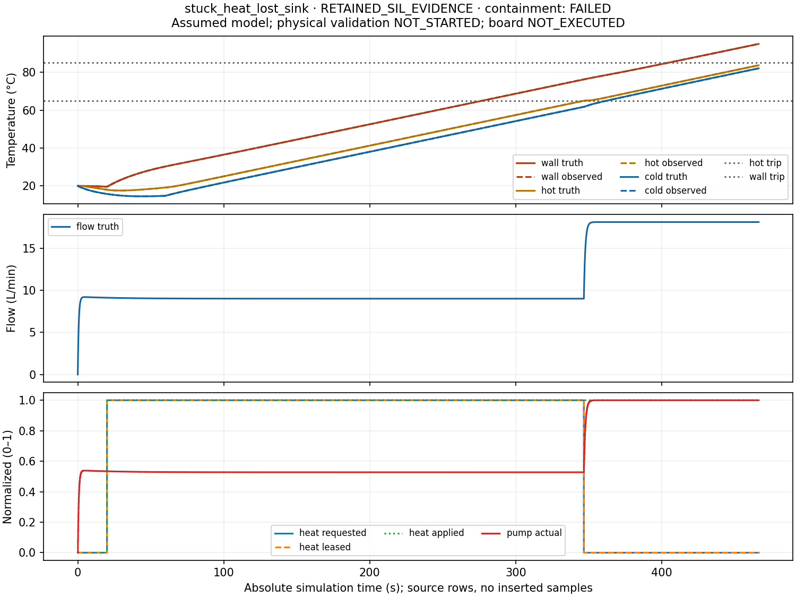

# Virtual Thermal Fluid Lab

An inspectable engineering test bench: a Python fluid/thermal plant, one portable
C11 controller shared by Windows/Linux SIL and Raspberry Pi Pico firmware, and a
static browser replay. It asks: **when circulation or heat rejection fails, what
does the controller observe, request, and actually achieve?**

[Interactive replay](https://walter.teitelbaum.us/assets/projects/virtual-thermal-fluid-lab/replay/)
· [Case study](https://walter.teitelbaum.us/2026/10/06/virtual-thermal-fluid-lab/)
· [Release and downloadable evidence](https://github.com/jewbee2000/virtual-thermal-fluid-lab/releases/tag/v0.1.0)
· [Five-minute walkthrough](docs/DEMO.md)



In the deliberately uncontained case, heat remains at 5 kW after the 346.6 s
shutdown request. The model reaches its 95 °C boundary at 466.299590 s and stops.
The replay retains that prefix and the failed containment judgment; it does not
turn a stop command into a safety claim.

## Run on native Windows

Install PowerShell 7, Python 3.12, uv, CMake and Microsoft C++ Build Tools with the C++ workload.
Run from PowerShell in this checkout; the scientific dependencies are locked.

```powershell
uv sync --locked
./scripts/build_host.ps1
uv run python scripts/run_campaign.py --exe artifacts/host-build/Release/fluid_controller_host.exe --out artifacts/demo --case nominal_heat_step --case frozen_temperature --case stuck_heat_lost_sink --skip-tank
uv run python scripts/build_replay.py --run artifacts/demo/nominal_heat_step --run artifacts/demo/frozen_temperature --run artifacts/demo/stuck_heat_lost_sink --out artifacts/replay
uv run python -m http.server 8000 --bind 127.0.0.1 --directory artifacts/replay
```

Open `http://127.0.0.1:8000/`. A downloaded replay also contains local scripts,
charts, data and licenses. Its direct-file path is designed for offline use;
browser QA in this environment used HTTP because automation blocks file URLs.
The plain replay ZIP needs no simulation tools to inspect its retained evidence.
This selected walkthrough is not the full release campaign.
See [setup](docs/START_HERE.md), [exact reproduction commands](docs/REPRODUCE.md)
and [Pico build/capture instructions](firmware/pico/README.md).

The original atmospheric tank remains runnable:

```powershell
uv run fluidlab scenarios/nominal.json --out artifacts/tank --plot
uv run python scripts/run_suite.py --out artifacts/tank-suite
```

## How the layers connect

```text
Scenario + virtual clock
        → Python plant truth → sensor/link adapter → shared C controller
        ← held physical inputs ← actuator faults ← requested commands
                         ↓
       evaluator → CSV / wire bytes / manifests → static replay

Pico: the same C core + timer / ADC / GPIO / USB / watchdog HAL
```

The controller sees observed I/O and configured limits. Plant truth and fault
labels stay in the plant, adapters and evaluator, outside the controller interface.
Integer virtual timestamps, held inputs and seeded
sample-time noise keep experiments reproducible. The tank uses ideal metered
inflow and gravity drainage; the thermal loop uses an assumed quadratic pump
intersection, two mixed liquid inventories, a hot wall and a fixed-temperature
sink. [Tank model](docs/MODEL.md) · [Thermal equations and pedigree](docs/THERMAL_MODEL.md)
· [Wire contract](schemas/protocol.md) · [Fault investigation](docs/FAILURE_INVESTIGATION.md).

## Executed software checks

The clean native Windows reproduction at `cc5a6fe` passed 135 unit tests, host and
device CTests, seven preserved Python tank scenarios, ten thermal benchmarks,
17 thermal C SIL scenarios, seven C tank scenarios and an identical nominal
repeat. All 36 refinement runs passed; the separate schema audit checked 48
thermal exports, 157,182 rows and 484 artifact hashes. Both Pico UF2 modes built.
The selected 240 s demo ran in 8.43 wall seconds with 465.2 MiB of observed process
peaks. This is a laptop observation with recorded monitoring limits, not a
hard-real-time or WCET claim. Actual commands, failures, revisions and limitations
are retained under [evidence](evidence/) and [tasks](docs/tasks.json).

The release requires Windows/MSVC, Linux/GCC, sanitizer and Pico cross-build CI,
fresh reproduction, asset/license audit and verified publication. The current
[workflow](https://github.com/jewbee2000/virtual-thermal-fluid-lab/actions/workflows/checks.yml)
shows exact run status; a pending run is not a passing check.

**Evidence limits:** parameters are assumed, board execution **NOT_EXECUTED**,
fixture **NOT_FABRICATED**, physical validation **NOT_STARTED**. Software
verification, peripheral execution, physical holdout validation and safety
certification are different gates. This educational loop is not Endurance's
digital twin. The [hardware packet](docs/hardware/PACKET.md) defines the next experiment.

[Requirements and frozen criteria](docs/REQUIREMENTS.md) were rationalized before
execution. The revised [implementation plan](docs/Codex_Implementation_Plan.md)
supersedes the starter milestones, preserved in [the archive](docs/archive/).
[Learning checkpoints](docs/LEARNING_CHECKPOINTS.md) and the [claims ledger](docs/CLAIMS.csv)
connect implementation decisions to evidence. Walter Teitelbaum authored the
starter; Codex assisted implementation, review and release preparation. New code
is MIT licensed; bundled dependencies retain their own notices.
